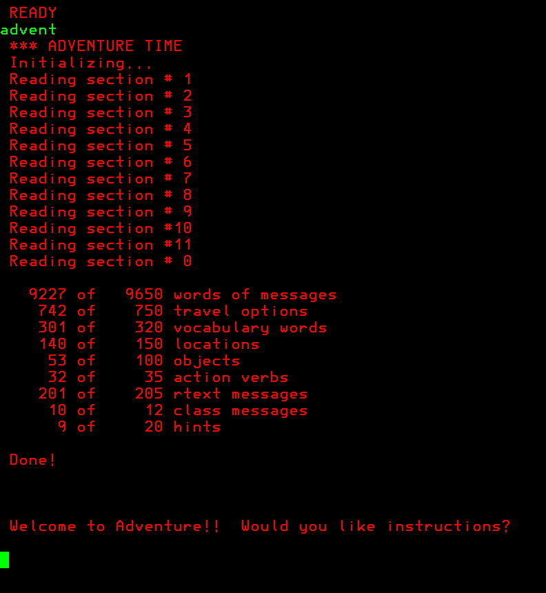

# Adventure

Colossal Cave Adventure (also known as ADVENT, Colossal Cave, or Adventure) is a text adventure game, developed between 1975 and 1977 by Will Crowther for the PDP-10 mainframe. The game was expanded upon in 1977 with help from Don Woods, and other programmers created variations on the game and ports to other systems in the following years. It was ported to MVS using PL/I around 1978.

:warning: **DO NOT EDIT `ADVNT360.PL1` with VS Code** it will replace non-printable characters with multibyte UTF characters and will prevent it from being compiled :warning:

## Install

1) run `make_jcl.sh > adventure.jcl`
2) Submit the JCL on MVS 3.8j using the socket reader: `ncat -v -w5 localhost 3505 < adventure.jcl`
3) Add `SYSC.PL1LIB` to `SYS1.PARMLIB(LNKLST00)` and re-ipl the system

## How to play

In TSO type `ADVENT` and play the game. To exit type `quit`.

